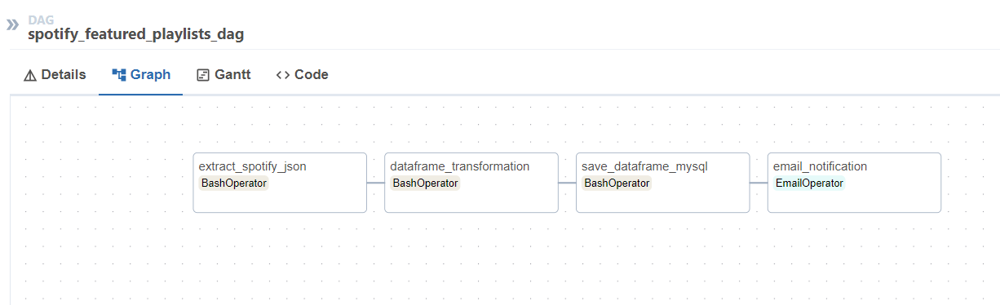

# etl-airflow-pandas

ETL pipeline with data from Spotify API - https://developer.spotify.com/

* Get data (featured playlists) from spotify api and save as json
* Get json and transform with pandas
* Save data in mysql
* Send a email notification in case of success or failure

